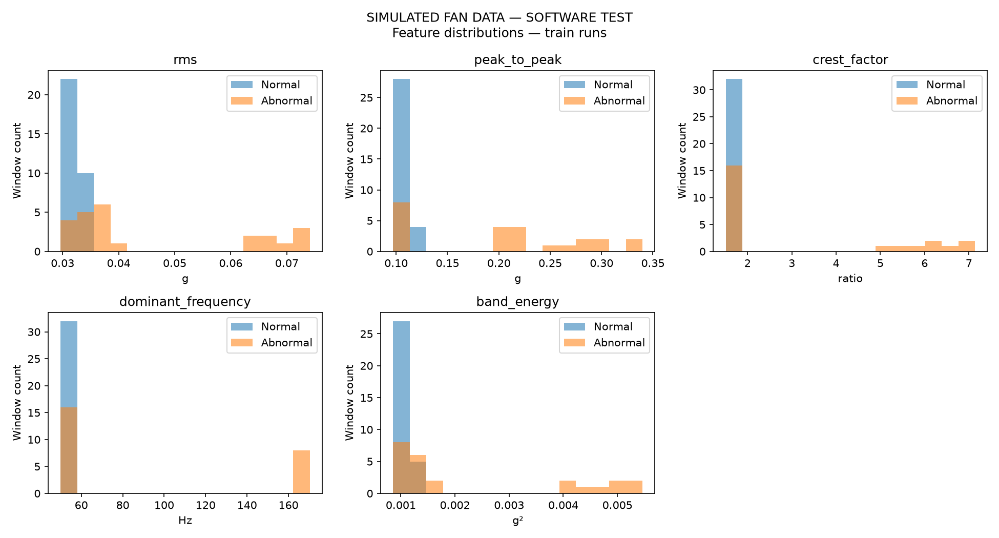
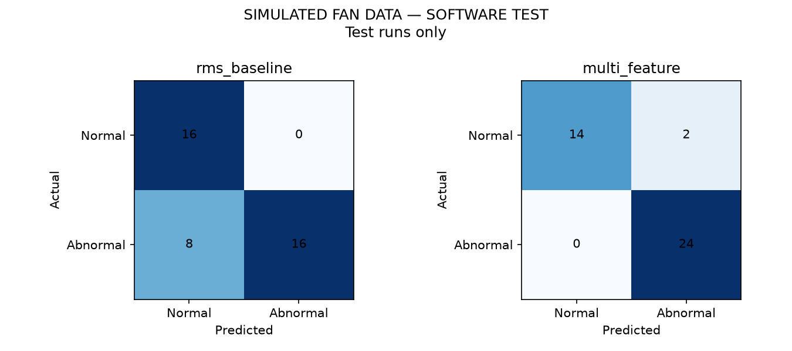
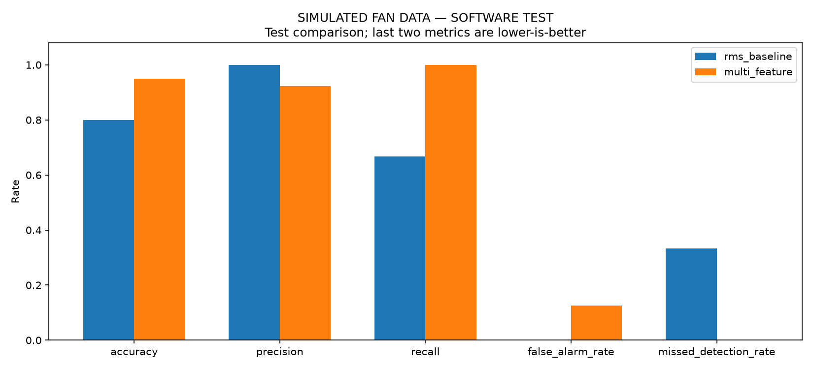

# P3 fan-vibration test result

Data source: **simulated**.

Simulated data tests software flow only; it is not experimental accuracy.

Train: 7 runs / 56 windows.
Test: 5 runs / 40 windows.
Test conditions: bearing_like, imbalance, loose_mount, normal.
Rejected windows: 0.

| Method | Accuracy | Precision | Recall | False alarm | Missed detection |
|---|---:|---:|---:|---:|---:|
| rms_baseline | 0.8000 | 1.0000 | 0.6667 | 0.0000 | 0.3333 |
| multi_feature | 0.9500 | 0.9231 | 1.0000 | 0.1250 | 0.0000 |

Positive label 1 means abnormal vibration. Metrics are per window.
Rows are actual and columns are predicted: [[TN, FP], [FN, TP]].
Thresholds and normalization use normal train windows only.
Do not tune using this final test split.

